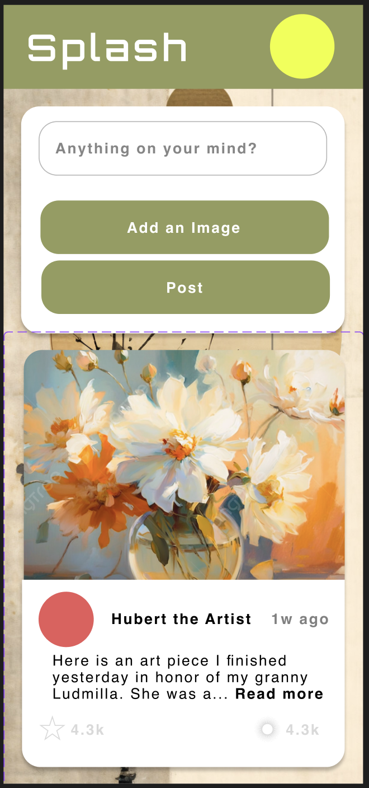
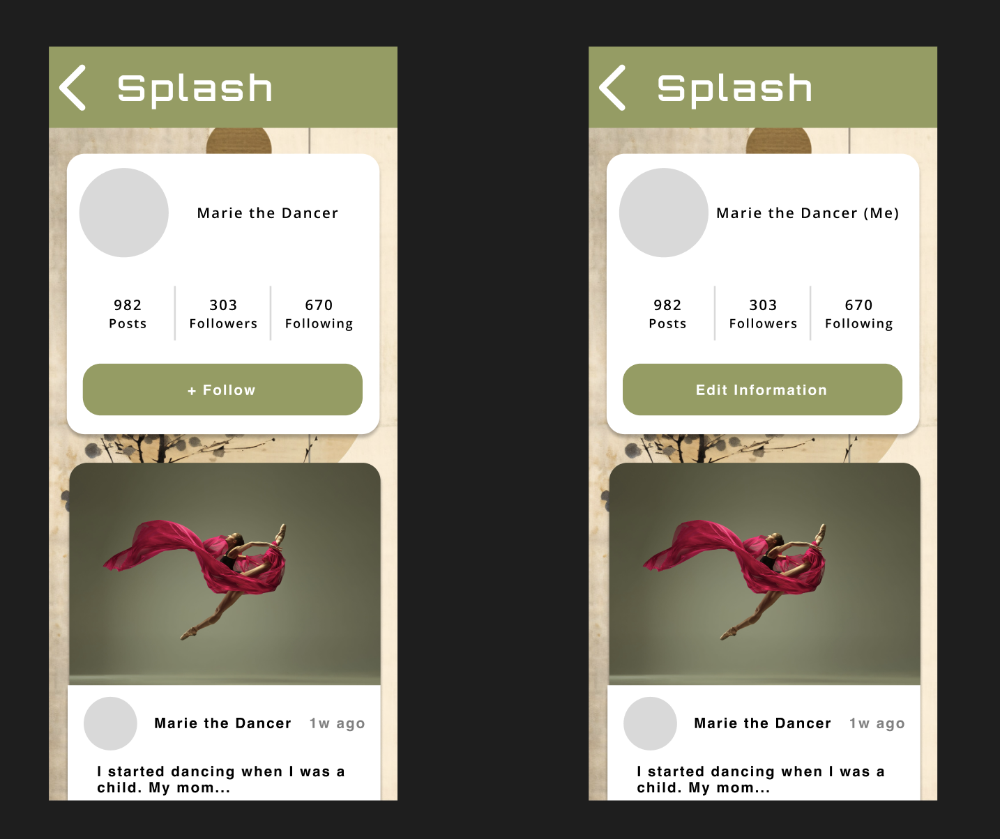
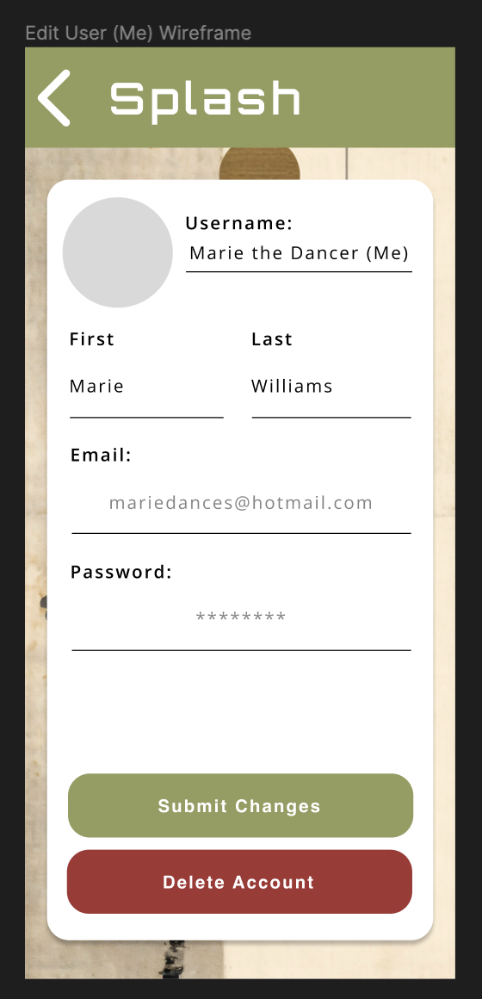
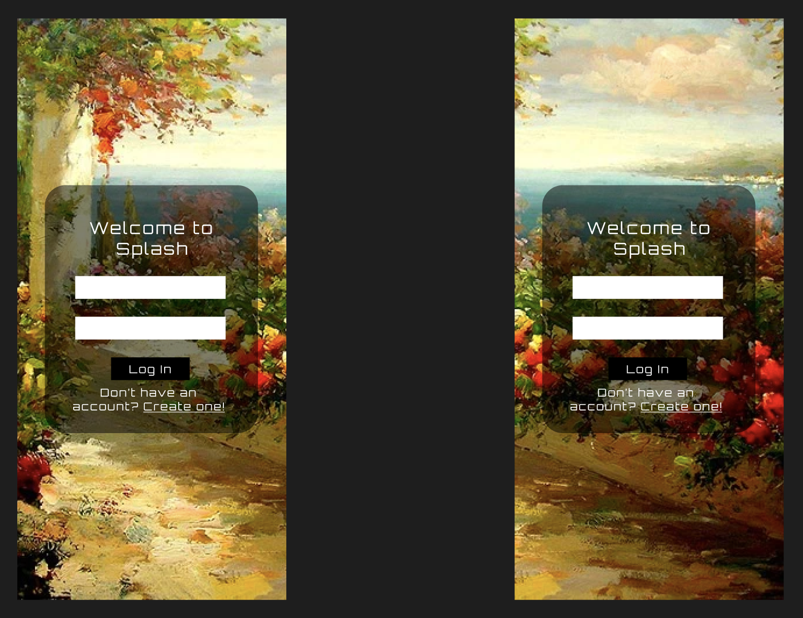
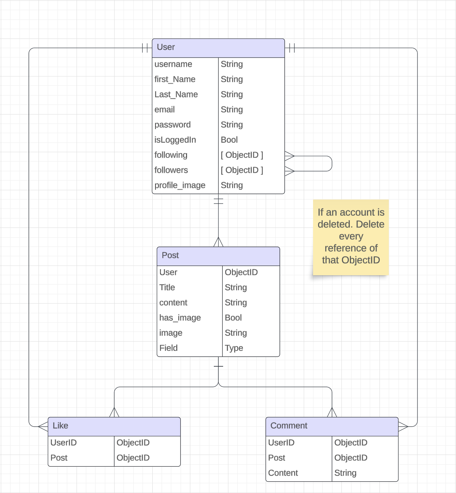

# Splash

Splash is an social media platform for artists and people seeking some relaxing time for their mental wellbeing. It is the ideal place for those seeking inspiration and/or relaxation. Come and chill with us.

## User Stories

- As a user, I should be able to scroll through my feed.
- As a user, I should be able to like and comment on posts.
- As a user, I should be able delete my own, and only my own, posts.
- As a user, I should be able to go to users' pages and scroll through their posts
- As a user, I should be able to edit my profile info

## Screens

### Feed

### User Screen

### Edit User Info Screen

### Log In Screen (Stretch)

## ERD

## MVP

User should be able to scroll through a feed easily without any issues–Liking and commenting on different posts as they please.

## Stretch Goals

User should be able to log in if they are not, and they should be able to log out if they so choose. At logout, they should be able to login with a different user info

## Creator

- [Abraham Guerrero](github.com/AbeGue02)